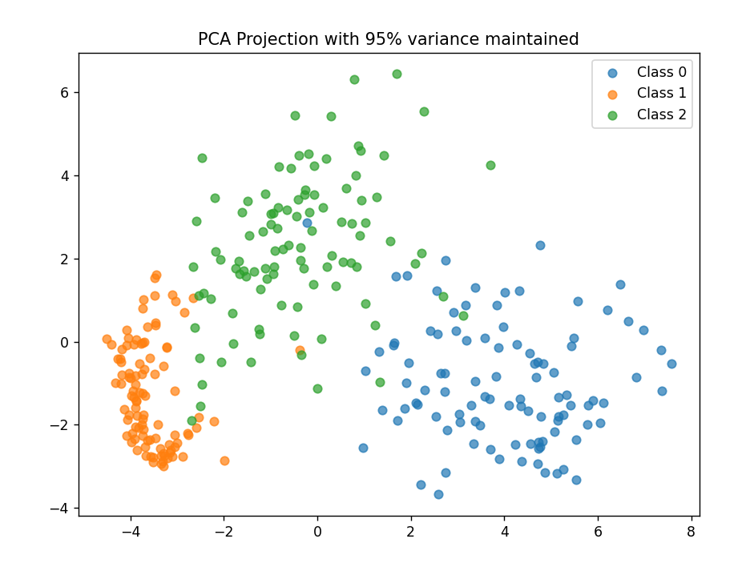
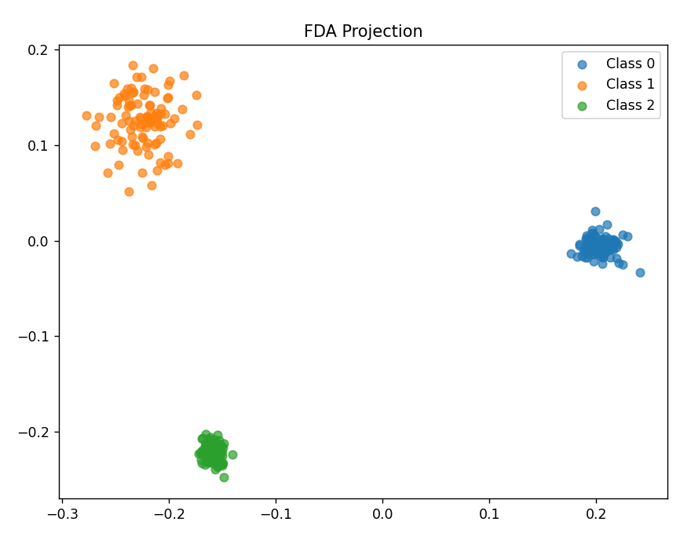
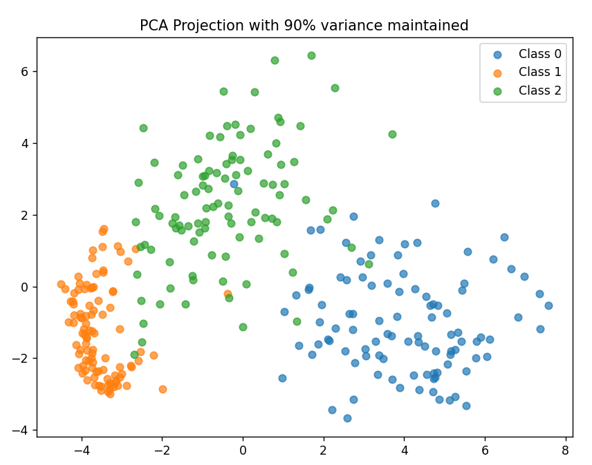
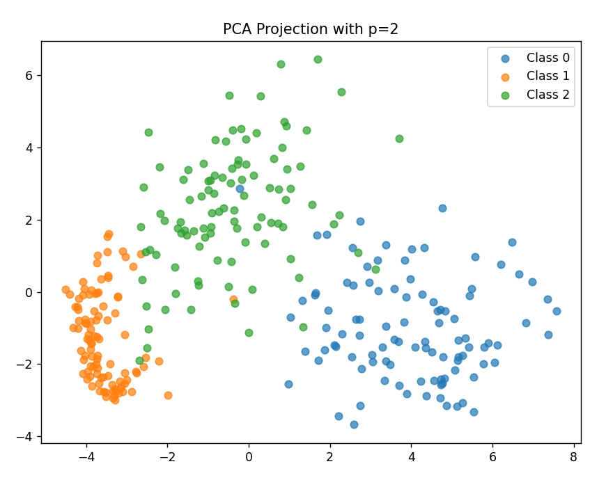

# MNIST Classification using PCA, FDA, and Discriminant Analysis

(For a particular train and test case that was randomly chosen at the time of the report, data is given at the end.)

## Objectives completed in each Task

### Data Preprocessing
- Extracted images corresponding to digits 0, 1, and 2 from the MNIST dataset.
- Normalized the images (dividing by 255) and converted them into a flattened vector representation.
- Obtained Test and Train datasets by random selection.

### Maximum Likelihood Estimation (MLE)
- Computed class-wise mean and covariance for each digit (0,1,2).
- Wrote my own covariance function for MLE assuming a Gaussian distribution.

### Principal Component Analysis (PCA)
- Applied PCA for dimensionality reduction (P was mostly in the range of 80-85 for maintaining a variance of 95%).
- Obtained Up, `Y = transpose(Up) x X`.
- Using Y, computed mean and covariance that were used in discriminant analysis.

### Fisher Discriminant Analysis (FDA)
- Computed Sb and Sw by the given formula.
- Computed `Y = transpose(W) x X`.
- Using Y, computed mean and covariance that were used in discriminant analysis.

### Evaluate and Compare Performance
- Similar to (4), performed LDA and QDA for both the test set and train set.
- Applied LDA as in (3).
- Applied LDA for variance 90%.
- Applied LDA for `p = 2`.

## Results and Analysis

### Accuracy of LDA and QDA classifiers
- Observed that QDA accuracy is smaller than LDA accuracy. Maybe QDA accuracy is lower because the covariance matrix obtained was based on only 100 samples each, and possibly, that covariance matrix is similar, so LDA works better.

### Analysis of how PCA affects classification performance
- Effectively reduced dimensionality while preserving essential information. This also made computation faster.

### Visualization of the transformed feature space
- For both FDA and PCA, 2D data were obtained and plotted using different colours and markers. The samples from 3 classes looked separable. See the graph below for the particular case.

---

## For particular data obtained at that time with random selection, the following values and graphs were obtained.

### PCA with 95% variance:
- **Test Data**:  
  - QDA accuracy: 90.0%  
  - LDA accuracy: 96.0%

- **Train Data**:  
  - QDA accuracy: 100.0%  
  - LDA accuracy: 100.0%
 

### After FDA:
- **Test Data**:  
  - QDA accuracy: 59.67%  
  - LDA accuracy: 83.67%

- **Train Data**:  
  - QDA accuracy: 100.0%  
  - LDA accuracy: 100.0%
 

---

### PCA with 90% variance:
- **Test Data**:  
  - QDA accuracy: 95.67%  
  - LDA accuracy: 96.67%

- **Train Data**:  
  - QDA accuracy: 99.67%  
  - LDA accuracy: 99.67%

 

---

### First 2 principal components:
- **Test Data**:  
  - QDA accuracy: 95.33%  
  - LDA accuracy: 94.0%

- **Train Data**:  
  - QDA accuracy: 94.67%  
  - LDA accuracy: 94.67%
 

